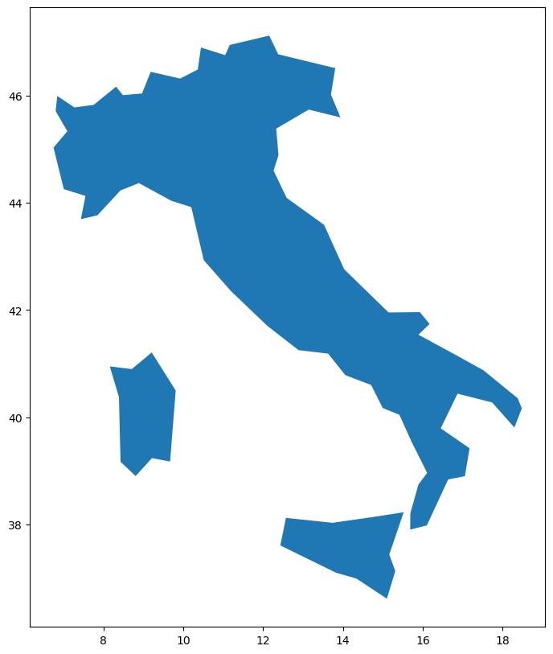
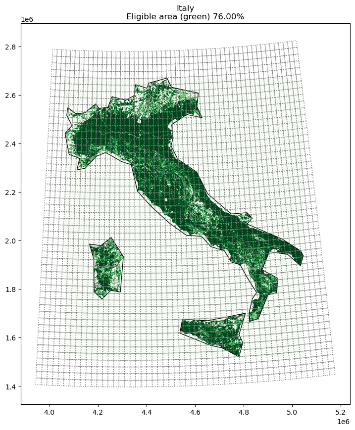
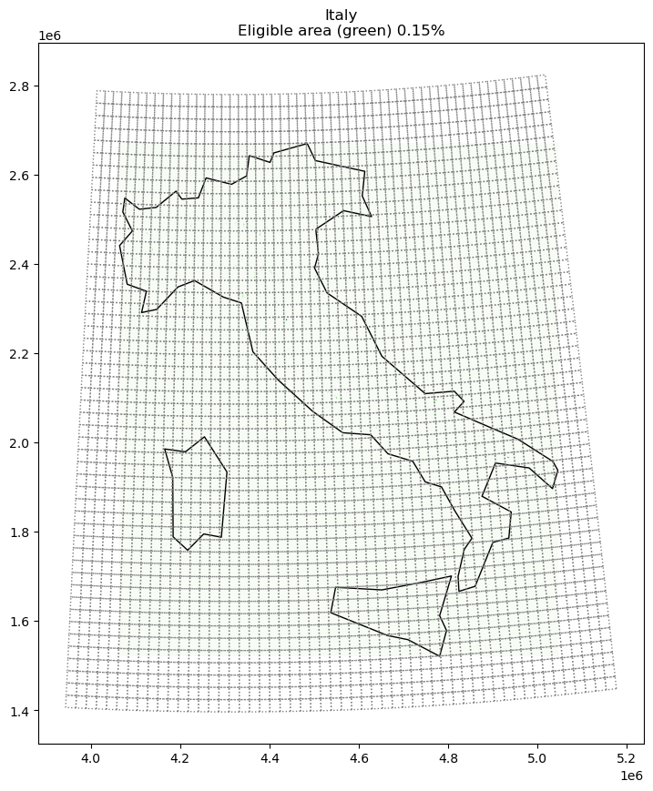
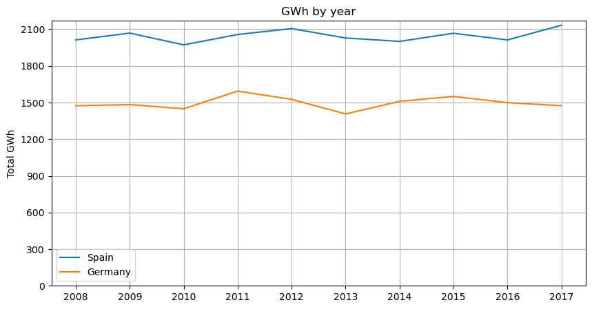

[Back to Portfolio](index)

---
## **PV Parks in *dump* designated territories: A business opportunity**

### Summary

In light of the rising demand for electricity on a global scale, and the need for it to come from non-fossil sources as much as possible, one alternative to look at is renewable energy. Given the space constraints to install a considerable capacity in most urban areas, one out-of-the-box possibility is to look at land already used for something else. Like, residual water plants, and landfills, among others. This project downloaded ten years of climate data from Copernicus –the European Union Earth observatory– for two very different countries regarding their amount of sunlight: Spain and Germany, to obtain the energy potential of installing PV panels on land with a land-use designation such as *dump*. The project objective is to
* Demonstrate that such output is big enough to be financially viable and successful.
* That the total production is consistent from year to year.

### How the algorithm works

The program starts by leveraging a Python library, Geopandas, to make a map of the region of interest.

    

    

Next, it will layer the map with a file from Copernicus to label each 100-meter by 100-meter land according to its designated land use. The first map is shown for illustrative purposes and considers  76% of the land as available for the solar energy simulation that would follow.

    

    

This would be the appropriate map for exclusively dump-designated land, which is well under 1% of Italy’s total area.

    

    

Finally, we can use one of the functions in the library Atlite, developed by PyPSA (Python for Power System Analysis).

This function needs the aforementioned layered map, a period of interest, and the material used in the solar panels. It returns the potential for solar energy per hour for that period.

Here is an example from one day in Italy:

<table border="1" class="dataframe">
  <thead>
    <tr style="text-align: right;">
      <th>name</th>
      <th>Italy[MWh]</th>
    </tr>
    <tr>
      <th>time</th>
      <th></th>
    </tr>
  </thead>
  <tbody>
    <tr>
      <th>2012-08-12 00:00:00</th>
      <td>0.000000</td>
    </tr>
    <tr>
      <th>2012-08-12 01:00:00</th>
      <td>0.000000</td>
    </tr>
    <tr>
      <th>2012-08-12 02:00:00</th>
      <td>0.000000</td>
    </tr>
    <tr>
      <th>2012-08-12 03:00:00</th>
      <td>0.000000</td>
    </tr>
    <tr>
      <th>2012-08-12 04:00:00</th>
      <td>0.000000</td>
    </tr>
    <tr>
      <th>2012-08-12 05:00:00</th>
      <td>2.272531</td>
    </tr>
    <tr>
      <th>2012-08-12 06:00:00</th>
      <td>52.335150</td>
    </tr>
    <tr>
      <th>2012-08-12 07:00:00</th>
      <td>165.167732</td>
    </tr>
    <tr>
      <th>2012-08-12 08:00:00</th>
      <td>278.057032</td>
    </tr>
    <tr>
      <th>2012-08-12 09:00:00</th>
      <td>374.598988</td>
    </tr>
    <tr>
      <th>2012-08-12 10:00:00</th>
      <td>425.547144</td>
    </tr>
    <tr>
      <th>2012-08-12 11:00:00</th>
      <td>472.031610</td>
    </tr>
    <tr>
      <th>2012-08-12 12:00:00</th>
      <td>482.036602</td>
    </tr>
    <tr>
      <th>2012-08-12 13:00:00</th>
      <td>461.512335</td>
    </tr>
    <tr>
      <th>2012-08-12 14:00:00</th>
      <td>381.271242</td>
    </tr>
    <tr>
      <th>2012-08-12 15:00:00</th>
      <td>303.535498</td>
    </tr>
    <tr>
      <th>2012-08-12 16:00:00</th>
      <td>214.674082</td>
    </tr>
    <tr>
      <th>2012-08-12 17:00:00</th>
      <td>96.738079</td>
    </tr>
    <tr>
      <th>2012-08-12 18:00:00</th>
      <td>17.960535</td>
    </tr>
    <tr>
      <th>2012-08-12 19:00:00</th>
      <td>0.011280</td>
    </tr>
    <tr>
      <th>2012-08-12 20:00:00</th>
      <td>0.000000</td>
    </tr>
    <tr>
      <th>2012-08-12 21:00:00</th>
      <td>0.000000</td>
    </tr>
    <tr>
      <th>2012-08-12 22:00:00</th>
      <td>0.000000</td>
    </tr>
    <tr>
      <th>2012-08-12 23:00:00</th>
      <td>0.000000</td>
    </tr>
  </tbody>
</table>

### Results from ten years of data in Spain & Germany

We generated the data to try and answer two questions: whether the variance from year to year was significant; and whether the overall yearly output was considerable. Here are the yearly aggregates for both Spain and Germany:

    

    

As can be seen, we answered both questions successfully. For Spain, the mean total production is around 2 TWh per year, for Germany it is around 1.5 TWh per year, with little yearly variation.

### Is there a business opportunity?

Even though production may be sufficiently constant, energy prices certainly are not. Because of that, we are interested in what the sales for each month would be. Considering the average production during the ten years, given the average energy prices for these countries for those months, we have for Spain and Germany (in Euros):

<table border="1" class="dataframe">
  <thead>
    <tr style="text-align: right;">
      <th></th>
      <th>Spain</th>
      <th>Germany</th>
    </tr>
  </thead>
  <tbody>
    <tr>
      <th>January</th>
      <td>€5,728,524.85</td>
      <td>€2,771,425.94</td>
    </tr>
    <tr>
      <th>February</th>
      <td>€5,711,302.37</td>
      <td>€3,601,582.43</td>
    </tr>
    <tr>
      <th>March</th>
      <td>€6,322,135.14</td>
      <td>€4,307,163.78</td>
    </tr>
    <tr>
      <th>April</th>
      <td>€5,260,211.78</td>
      <td>€7,011,996.35</td>
    </tr>
    <tr>
      <th>May</th>
      <td>€6,041,815.57</td>
      <td>€6,874,454.48</td>
    </tr>
    <tr>
      <th>June</th>
      <td>€7,802,645.52</td>
      <td>€5,728,417.60</td>
    </tr>
    <tr>
      <th>July</th>
      <td>€9,078,421.20</td>
      <td>€7,174,306.96</td>
    </tr>
    <tr>
      <th>August</th>
      <td>€9,176,622.10</td>
      <td>€6,261,559.43</td>
    </tr>
    <tr>
      <th>September</th>
      <td>€8,935,083.73</td>
      <td>€4,760,102.52</td>
    </tr>
    <tr>
      <th>October</th>
      <td>€7,050,946.52</td>
      <td>€3,605,496.62</td>
    </tr>
    <tr>
      <th>November</th>
      <td>€5,978,127.94</td>
      <td>€2,381,008.68</td>
    </tr>
    <tr>
      <th>December</th>
      <td>€5,612,817.79</td>
      <td>€1,378,047.06</td>
    </tr>
    <tr>
      <th>Annual</th>
      <td>€82,698,654.51</td>
      <td>€55,855,561.85</td>
    </tr>
  </tbody>
</table>

Currently, solar panels are being guaranteed for a useful life of 25 years. Also, the capital expenditure, which is most of a solar farm’s cost, is at around $700 dollars per MW of capacity on a utility scale. Because of this, investors could potentially have around 12 years of positive cash flow after the payback period.

### Conclusions

The results show that even in countries with apparently little solar energy potential, such as Germany, sales can be high and steady. And given the low costs of entry for this market, it is an opportunity that should be considered in more detail.

### References

* [Copernicus](https://www.copernicus.eu/en)
* [Atlite](https://atlite.readthedocs.io/en/latest/)
* [Full Project](https://github.com/roberto-andrade22/PV_Parks_EU)

### Further Reading

* [Solargis (World Bank)](https://solargis.com/es/maps-and-gis-data/download/world)
* [EPA: RePowering America's Land](https://www.epa.gov/system/files/documents/2021-11/re_on_cl_tracking_matrix_110321_508.pdf)

---

[Back to Portfolio](index)